<!--- STARTEXCLUDE --->
# 🎓 Netflix Clone using Astra DB and GraphQL

[](https://gitpod.io/from-referrer/)
[](http://www.apache.org/licenses/LICENSE-2.0)
[](https://discord.com/widget?id=685554030159593522&theme=dark)

*50 minutes, Intermediate, [Start Building](#1-login-or-register-to-astradb-and-create-database)*

A simple **ReactJS** Netflix homepage clone running on *Astra DB* that leverages the GraphQL API with *paging* and *infinite scrolling.*
This application is the result of the collaboration between [Ania Kubow](https://www.youtube.com/channel/UC5DNytAJ6_FISueUfzZCVsw) and the Datastax Developer Advocate team.

<!--- ENDEXCLUDE --->

See the [Video Walkthrough](https://imgur.com/3ns3UJB) of what you will build!


## 🎯 Objectives
* Build and run a Netflix clone.
* Learn **GraphQL API** and how to use it with a database to create the tables and navigate the data.
* Learn about **pagination** and **infinite scrolling** in a Web UI.
* Leverage Netlify and DataStax Astra DB.
* Deploy the Netflix clone to production with Netlify.

## ℹ️ Frequently asked questions ℹ️

<details>
<summary><strong>Can I run the workshop on my computer?</strong></summary>

There is nothing preventing you from running the workshop on your own machine.
If you do so, you will need
* git installed on your local system
* [node 15 and npm 7 or later](https://www.whitesourcesoftware.com/free-developer-tools/blog/update-node-js/)

You will have to adapt commands and paths based on your environment and install the dependencies by yourself. **We won't provide support** to keep on track with schedule. However, we will do our best to give you the info you need to be successful.

</details>

<details>
<summary><strong>What other prerequisites are there?</strong></summary>

* You will need a github account
* You will also need Netlify and Astra DB accounts, but we'll work through that in the exercises
* Use **Chrome** or **Firefox** for the best experience. Other browsers are great, but don't work well with the GitPod integration we use a bit later.

</details>

<details>
<summary><strong>Do I need to pay for anything for this workshop?</strong></summary>

**No.** All tools and services we provide here are FREE.

</details>

<details>
<summary><strong>Will I get a certificate if I attend this workshop?</strong></summary>

Attending the session is not enough. You need to complete the homeworks detailed below and you will get a nice badge.

</details>


## Materials for the Session

It doesn't matter if you join our workshop live or you prefer to do at your own pace, we have you covered. In this repository, you'll find everything you need for this workshop:

- [Slide deck](slides/slides.pdf)
- [Discord chat](https://bit.ly/cassandra-workshop)
- ["cassandra" on StackOverflow](https://stackoverflow.com/questions/tagged/cassandra)
- ["cassandra" on DBA StackExchange](https://dba.stackexchange.com/questions/tagged/cassandra)


# Let's start

## Table of contents

### Part I - DB Setup & Data Ingest
1. [Create Astra DB Instance](#1-login-or-register-to-astradb-and-create-database)
2. [Create a security token](#2-create-a-security-token)
3. [Create table for genres with GraphQL](#3-create-table-for-genres-with-graphql)
4. [Insert genre data with GraphQL](#4-insert-genre-data-with-graphql)
5. [Retrieve genres with GraphQL](#5-retrieve-genres-with-graphql)
6. [Create a table for movies](#6-create-a-table-for-movies)
7. [Insert a few movies](#7-insert-a-few-movies)
8. [Retrieve movies: Pagination](#8-retrieve-movies-pagination)

### Part II - Build and Deploy Front-End

1. [Deploy to Netlify](#1-deploy-to-netlify)
2. [Launch Gitpod from YOUR Github repo](#2-launch-gitpod-from-your-github-repo)
3. [Set up and use `astra-cli`](#3-set-up-and-use-astra-cli)
4. [Serverless Functions](#4-serverless-functions)
5. [Fetching from the Front-End](#5-fetching-from-the-front-end)
6. [Install the Netlify CLI](#6-install-the-netlify-cli)
7. [Provide DB connection parameters](#7-provide-db-connection-parameters)
8. [Run the app in dev mode](#8-run-the-app-in-dev-mode)
9. [Connect to your Netlify site](#9-connect-to-your-netlify-site)
10. [Deploy in production!](#10-deploy-in-production)

[**Complete the assignment, receive your Badge!**](#homework)

### Extra resources

- [Intro to GraphQL Workshop](https://github.com/datastaxdevs/workshop-intro-to-graphql)
- [React starter using NPX](https://github.com/datastaxdevs/react-basics)
- [React ToDo app](https://github.com/datastaxdevs/appdev-week1-todolist)
- [What is JamStack?](https://github.com/datastaxdevs/workshop-battlestax/blob/master/README_JAM.md)
- [Video tutorial with Ania Kubow](#video-tutorial-with-ania-kubow)

# Part 1 - DB Setup & Data Ingest

## 1. Login or Register to AstraDB and create database

> 🎁 *When creating your instance, use the promotion code **ANIA200** to get 200$ of additional free credit!*

_**`ASTRA DB`** is the simplest way to run Cassandra with zero operations at all - just push the button and get your cluster. No credit card required, 40M read/write operations and about 80GB storage monthly for free - sufficient to run small production workloads. If you use up your credits the databases will pause, no charge, and you will be given the option to upgrade to a higher tier._

Leveraging [Database creation guide](https://awesome-astra.github.io/docs/pages/astra/create-instance/#c-procedure) create a database. **Right-Click** the following button and *Open in a new TAB.*

<a href="https://astra.dev/yt-01-04"></a>

|Field|Value|
|---|---|
|**Database Name**| `workshops`|
|**Keyspace Name**| `netflix`|
|**Regions**| Select `GOOGLE CLOUD`, then an Area close to you, then a region with no LOCK 🔒 icons: the LOCKed regions are the region not accessible to the Free Tier.

> **ℹ️ Note:** If you already have a database `workshops`, simply add a keyspace `netflix` using the `Add Keyspace` button on the bottom right hand corner of the DB Dashboard page. You may have to "Resume" the database first in case it is in "hibernated" state.

While the database is being created, you will also get a **Security token** (needed to authenticate with your database and start using it):
**please IGNORE THIS ONE, as we will be soon creating a new, more powerful token for today**.

The status will change from `Pending` to `Active` when the database is ready, this usually only takes 2-3 minutes.


## 2. Create a security token

> Note: this step is very important, as the token generated automatically for you with
> the database lacks some permissions we'll use in the workshop.

[Create a token for your app](https://awesome-astra.github.io/docs/pages/astra/create-token/#c-procedure), _using the **"Database Administrator"** role_.
Keep it handy for later use (best to download it in CSV format, as the values
will not be visible afterward).
This will provide authentication later when interacting with the database.
Today, in particular, we will need the string labeled "token" (the one starting with `AstraCS:...`).

> **⚠️ Important**
> ```
> The instructor will show the token creation on screen,
> but will then destroy it immediately for security reasons.
> ```


## 3. Create table for genres with GraphQL

✅  **Step 3a:** Open **GraphQL Playground**:

0. Ensure you are logged on to your [Astra](https://astra.datastax.com) account
1. Click on the "workshops" database on the left (expanding the list if needed)
2. Click `Connect` TAB
3. Click the `APIs`  connection method
4. Make sure `GraphQL API` is selected
5. Locate the link to your GraphQL Playground in the text

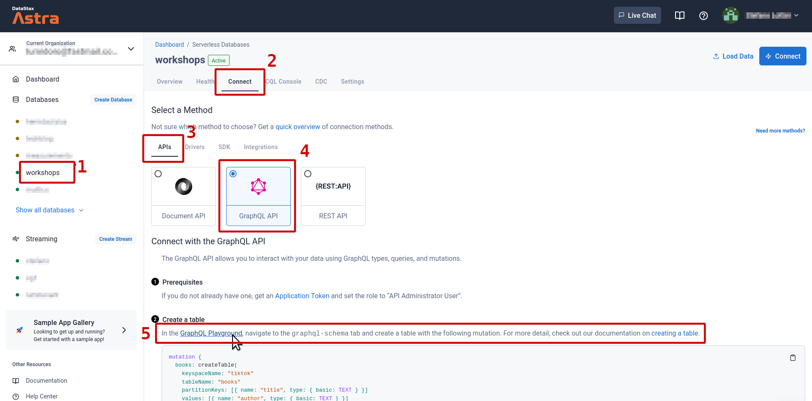

<details>
<summary><strong>Click here if you are using the "New Astra Experience" UI</strong></summary>

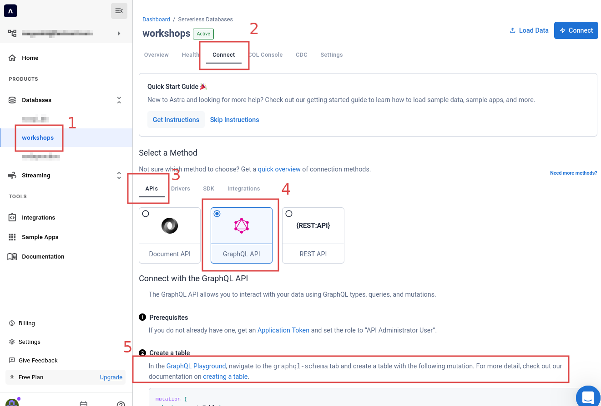

</details>

**Note**: in the following, we will refer to "playground tabs". These are _not_ the tabs
in your browser, rather they are tabs _within_ the Playground application,
to switch between the (logically distinct) realms of "managing schema" and "managing data in the tables"
(more on that later).

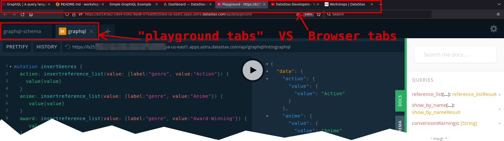

✅  **Step 3b:** Provide the database token as header

In the GraphQL Playground, **Populate HTTP HEADER** variable `x-cassandra-token` on the bottom of the page with your token (including the `AstraCS:` part).
_This is the "Database Administrator" token you created earlier on the Astra DB dashboard (Step 2 above)._


<details>
<summary>
<strong>Note</strong>: make sure you are on the <strong>graphql-schema</strong> playground tab in this step. Click here to show image.
</summary>

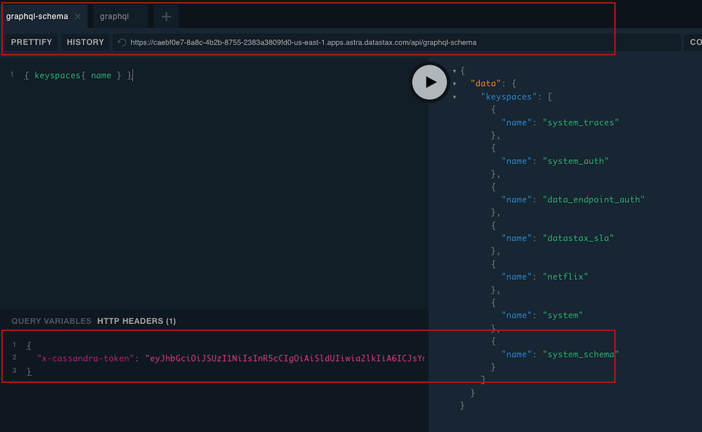

</details>

> Note: the GraphQL Playground starts with a ready-to-use _temporary token_ as the `x-cassandra-token` header. But we want the queries run in the Playground
> to be identical to those that the Netlify functions will run from code, so **please replace the token with your DB token as instructed**.

✅  **Step 3c:** In GraphQL Playground, create the `reference_list` table:

Copy the following **mutation** to the left panel

```yaml
mutation createReferenceList {
  reference_list: createTable(
    keyspaceName:"netflix",
    tableName:"reference_list",
    ifNotExists:true
    partitionKeys: [ 
      { name: "label", type: {basic: TEXT} }
    ]
    clusteringKeys: [
      { name: "value", type: {basic: TEXT}, order: "ASC" }
    ]
  )
}
```

<details>
<summary>and then use the big "play button" arrow in the center to execute it. Click for screenshot.</summary>


</details>


**GraphQL Playground troubleshooting** (covers this whole section)

|Trouble| Shooting|
|---|---|
|Server cannot be reached | Add Astra token to headers (including `AstraCS:...`; check quotes) |
|Server cannot be reached (second playground tab) | Check playground target URL ends with `netflix` |
Response not successful: Received status code 401 | Same as "server cannot be reached" |
| Response not successful: Received status code 404 | Check spelling of keyspace in target URL |
|"Play" button does nothing| Ensure query is syntactically correct |
"Validation error of type FieldUndefined" | Most likely query in the wrong playground tab, or writing to table not created yet |

## 4. Insert genre data with GraphQL

✅  **Step 4a:** In graphQL playground, change playground tab to now use `graphql`. The Playground has its own "address bar"
(**note**: not the one of your browser). Edit the end of the URL there, from `system` to the name of your keyspace: `netflix`

✅  **Step 4b:** Repeat the insertion of the `x-cassandra-token` header for this playground tab (as you did for the first one):

<details>
<summary>Show me!</summary>


</details>

✅  **Step 4c:** In the GraphQL Playground, run the mutation that writes genre data:

Copy the following mutation on the left panel:

```yaml
mutation insertGenres {
  action: insertreference_list(value: {label:"genre", value:"Action"}) {
    value{value}
  }
  anime: insertreference_list(value: {label:"genre", value:"Anime"}) {
     value{value}
  }
  award: insertreference_list(value: {label:"genre", value:"Award-Winning"}) {
     value{value}
  }
  children: insertreference_list(value: {label:"genre", value:"Children & Family"}) {
     value{value}
  }
  classic: insertreference_list(value: {label:"genre", value:"Classic"}) {
     value{value}
  } 
  comedies: insertreference_list(value: {label:"genre", value:"Comedies"}) {
     value{value}
  }
  crime: insertreference_list(value: {label:"genre", value:"Crime"}) {
     value{value}
  } 
  cult: insertreference_list(value: {label:"genre", value:"Cult"}) {
     value{value}
  }  
  documentaries: insertreference_list(value: {label:"genre", value:"Documentaries"}) {
     value{value}
  }
  drama: insertreference_list(value: {label:"genre", value:"Dramas"}) {
     value{value}
  }
  fantasy: insertreference_list(value: {label:"genre", value:"Fantasy"}) {
     value{value}
  }
  french: insertreference_list(value: {label:"genre", value:"French"}) {
     value{value}
  }
  horror: insertreference_list(value: {label:"genre", value:"Horror"}) {
     value{value}
  }
  independent: insertreference_list(value: {label:"genre", value:"Independent"}) {
     value{value}
  }
  international: insertreference_list(value: {label:"genre", value:"International"}) {
     value{value}
  } 
  italian: insertreference_list(value: {label:"genre", value:"Italian"}) {
     value{value}
  } 
  musicmusicals: insertreference_list(value: {label:"genre", value:"Music & Musicals"}) {
     value{value}
  } 
  realitytv: insertreference_list(value: {label:"genre", value:"Reality TV"}) {
     value{value}
  } 
  romance: insertreference_list(value: {label:"genre", value:"Romance"}) {
     value{value}
  }
  scifi: insertreference_list(value: {label:"genre", value:"Sci-Fi"}) {
     value{value}
  }
  thriller: insertreference_list(value: {label:"genre", value:"Thriller"}) {
     value{value}
  } 
  tvshow: insertreference_list(value: {label:"genre", value:"TV Show"}) {
     value{value}
  } 
}
```

then click on the big "play button" arrow in the center to execute the mutation

## 5. Retrieve genres with GraphQL

✅  **Step 5a:** In GraphQL Playground, not changing playground tab (stay on the second: "graphql", yeah) run the following query to read the `value` column of all table rows:

```yaml
query getAllGenres {
    reference_list (value: {label:"genre"}) {
      values {
      	value
      }
    }
}
```

<details>
<summary>
Show me!
</summary>


</details>

## 6. Create a table for movies

✅  **Step 6a:** Switch back to first playground tab ("graphql-schema"; the token header will be already set).

<details>
<summary>
Click for screenshot
</summary>


</details>

Use the following mutation to create a new table:

```yaml
mutation createMoviesTable {
  movies_by_genre: createTable(
    keyspaceName:"netflix",
    tableName:"movies_by_genre",
    ifNotExists: true,
    partitionKeys: [
      { name: "genre", type: {basic: TEXT} }
    ]
    clusteringKeys: [ 
      { name: "year", type: {basic: INT}, order: "DESC" },
      { name: "title", type: {basic: TEXT}, order: "ASC" }
    ]
    values: [
      { name: "synopsis", type: {basic: TEXT} },
      { name: "duration", type: {basic: INT} },
      { name: "thumbnail", type: {basic: TEXT} }
    ]
  )
}
```

<details>
<summary>
Show me!
</summary>


</details>

## 7. Insert a few movies

✅  **Step 7a:** Go to playground tab "graphql" again. 

<details>
<summary>
Click for screenshot
</summary>


</details>

Use the following mutation to populate the `movies_by_genre` table with four movies:

```yaml
mutation insertMovies {
  inception: insertmovies_by_genre(
    value: { 
      genre:"Sci-Fi", 
      year:2010,
      title:"Inception",
      synopsis:"Cobb steals information from his targets by entering their dreams.",
      duration:121,
      thumbnail:"https://i.imgur.com/RPa4UdO.mp4"}) {
        value{title}
    }
  
  prometheus: insertmovies_by_genre(value: { 
      genre:"Sci-Fi", 
      year:2012,
      title:"Prometheus",
      synopsis:"After a clue to mankind's origins is discovered, explorers are sent to the darkest corner of the universe.",
      duration:134,
      thumbnail:"https://i.imgur.com/L8k6Bau.mp4"}) {
        value{title}
    }
  
  	aliens: insertmovies_by_genre(value: { 
      genre:"Sci-Fi", 
      year:1986,
      title:"Aliens",
      synopsis:"Ellen Ripley is sent back to the planet LV-426 to establish contact with a terraforming colony.",
      duration:134,
      thumbnail:"https://i.imgur.com/QvkrnyZ.mp4"}) {
        value{title}
    }
  
    bladeRunner: insertmovies_by_genre(value: { 
      genre:"Sci-Fi", 
      year:1982,
      title:"Blade Runner",
      synopsis:"Young Blade Runner K's discovery of a long-buried secret leads him to track down former Blade Runner Rick Deckard.",
      duration:145,
      thumbnail:"https://i.imgur.com/xhhvmj1.mp4"}) {
        value{title}
    }
  }
```

<details>
<summary>
Show me!
</summary>


</details>


## 8. Retrieve movies: Pagination

✅  **Step 8a:** In GraphQL Playground, not changing playground tab (stay on the second tab, "graphql", yeah) list values from the table with the following command:

```yaml
query getMovieAction {
  movies_by_genre (
    value: {genre:"Sci-Fi"},
     orderBy: [year_DESC]) {
    values {
      year,
      title,
      duration,
      synopsis,
      thumbnail
    }
  }
}
```

<details>
<summary>
Show me!
</summary>

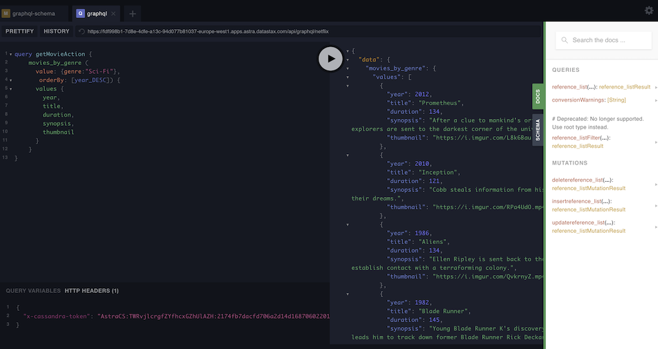

</details>


✅ **Step 8b: Enable pagination:** On a small dataset, you can retrieve all values in the table at once; but in general, for performance or network reasons, you'll need pagination. Let's do the same query as before, but asking for a _page size of 2_:

```yaml
query getMovieActionPag1 {
    movies_by_genre (
      value: {genre:"Sci-Fi"},
       options: {pageSize: 2},
       orderBy: [year_DESC]) {
      values {
        year,
        title,
        duration,
        synopsis,
        thumbnail
      }
    pageState
    }
}
```

<details>
<summary>
Show me!
</summary>

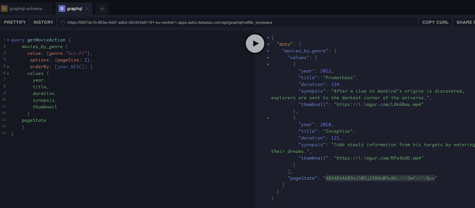

</details>


✅ **Step 8c: Fetch next page:** Notice that `pageState` now is also returned. Let's use it to fetch the next 2 items (next page). Edit the next query to replace `YOUR_PAGE_STATE` with your own string value:

```yaml
query getMovieActionNextPage {
    movies_by_genre (
      value: {genre:"Sci-Fi"},
       options: {pageSize: 2, pageState: "YOUR_PAGE_STATE"},
       orderBy: [year_DESC]) {
      values {
        year,
        title,
        duration,
        synopsis,
        thumbnail
      }
    pageState
    }
}
```
 
<details>
<summary>
Show me!
</summary>

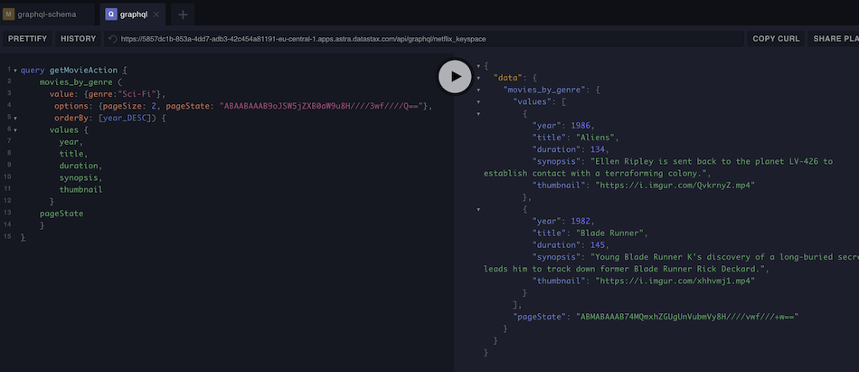

</details>


If you try to paste the _newly-obtained_ value for `pageState` and re-run the query, you get an empty list and a null `pageState` in return. D'oh! We had scrolled through all rows already:
_this is how pagination signals the end of the full results list._

# Part 2 - Build and Deploy Front-End


## 1. Deploy to Netlify

✅ **Step 1a: Netlify Button:** Click the following button to deploy to Netlify.

**Note**: preferrably Ctrl-click for a new tab.

<details>
<summary>
What does the Netlify deploy button do?
</summary>

The Netlify deploy button will:

- Create a new repository for you on Github (an unrelated _copy_, not a fork)
- Create a site on Netlify (and deploy a nonworking build of the app, which lacks the DB connection parameters still)
- Link the two together.

</details>

[](https://app.netlify.com/start/deploy?repository=https://github.com/datastaxdevs/workshop-graphql-netflix)

<details><summary>Show me!</summary>


</details>

This will take a few minutes:

- you may have to authenticate through Github in the process;
- confirm the repo name and "Save & Deploy" when asked.

_Note: if there is an existing account in Netlify, check the settings to make sure the Netlify account is connected to the your Github account._

<details><summary>Show me!</summary>


</details>

✅ **Step 1b: Check the deploy logs:** Click on `Site deploy in progress` within the Netlify UI.

<details><summary>Show me!</summary>


</details>

Then click the top deploy link to see the build process.

<details><summary>Show me!</summary>


</details>

✅ **Step 1c: Complete the build:** Wait until the build shows `Netlify Build Complete`,  **When you see "_Pushing to repository..._"** you're ready to move on.

<details><summary>Show me!</summary>


</details>

✅ **Step 1d: Get back to your new site:** Scroll up to the top and click on the site name (it'll be after "_[your login]_'s Team" next to the Netlify button).

<details><summary>Show me!</summary>

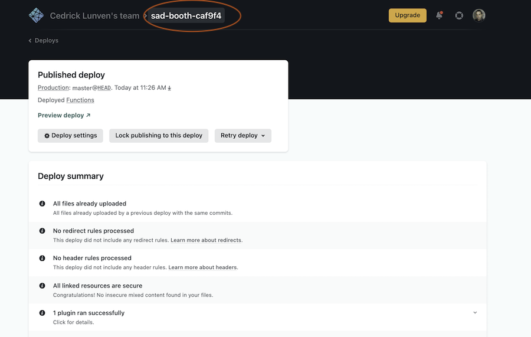

</details>

## 2. Launch Gitpod from YOUR Github repo

✅ **Step 2a: Jump to YOUR repo:** Click on the `GitHub` in `Deploys from GitHub` to get back to your new repository.
Scroll to where you were in the README.

<details><summary>Show me!</summary>

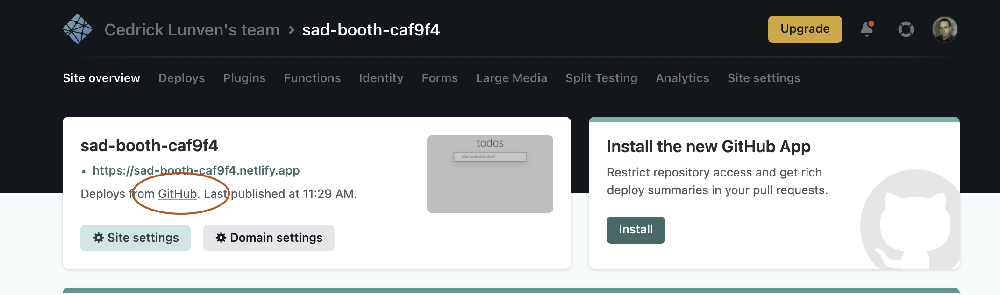

</details>

**Note** At this point, you MUST be reading this README from **YOUR** Github repository.
That is, if the address bar still says `https://github.com/datastaxdevs/...` please
head over to YOUR copy of the repo before going the Gitpod route!

✅ **Step 2b: Launch Gitpod:** Use this link to open Gitpod from **YOUR** repository! (_Tip: Ctrl-click on the button to open in new tab._)

[](https://gitpod.io/from-referrer/)

_Note: the button works on  Chrome and  Firefox._

<details>
<summary>Click to troubleshoot if you have another browser</summary>


</details>

ℹ️ _It may take a few minutes (approx. 3-5) for GitPod to fully initialize.
Please wait until the console in the lower half of Gitpod is responsive._

Gitpod will be your IDE from now on. If you are familiar with VSCode, you can probably
just use it. Otherwise, take a moment to review a separate page
["Know your Gitpod"](know_your_gitpod.md)
and then come back here.

## 3. Set up and use `astra-cli`

You are going to use a CLI tool to simplify operations with Astra DB. The tool
is [preinstalled](https://docs.datastax.com/en/astra-classic/docs/astra-cli/installation.html)
on your Gitpod.

✅ **Step 3a: Set up the CLI:** Run the following in the Gitpod terminal and,
when prompted, enter the `AstraCS:...` you obtained at the beginning.

``` bash
astra setup
```

<details>
<summary>
Show me!
</summary>

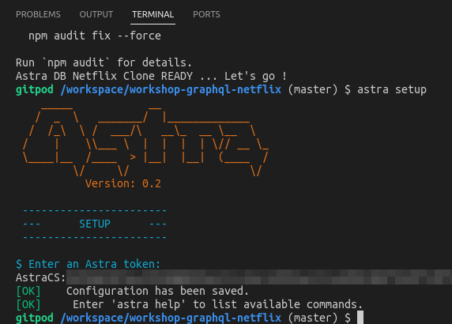

</details>


✅ **Step 3b: Bulk data load:** Load a large movie dataset in the database.
This command installs and properly launches the `DSBulk` tool:

``` bash
astra db load workshops \
  -url data/movies_by_genre.csv \
  -k netflix \
  -t movies_by_genre
```

<details><summary>Show the syntax for old versions of astra-cli</summary>

Note: you should not need this.

```bash
astra db dsbulk workshops load \
  -url data/movies_by_genre.csv \
  -k netflix \
  -t movies_by_genre
```

> *Note*: we mock the trailers for these thousands of movies by using a handful
> of them over and over. Don't be surprised if you'll see the wrong trailers
> for your favorite movie!

</details>

<details>
<summary>
Show me!
</summary>

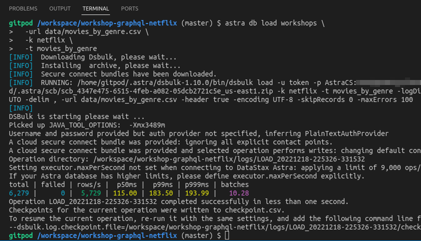

</details>

That's it! All 6000+ movies are now loaded and ready to go!

## 4. Serverless Functions

> _Note_: this section and the next one ("Fetching from the Front-End")
> are not steps to "perform", rather suggestions to dive in the client
> code and figure out how the various parts (React components, Netlify
> functions and finally the GraphQL server in Astra DB) fit together.
> **You can skip them and jump to the [next practical step](#6-install-the-netlify-cli)**
> if you are in a hurry, but please come back to these
> for reference if you want to dissect the code a bit!

<details><summary>Show me this section</summary>

Take a look at `functions/getGenres.js`

```javascript
const fetch = require('node-fetch')

exports.handler = async function (event) {

  const body = JSON.parse(event.body)
  const url = process.env.ASTRA_DB_GRAPHQL_URL
  const query = `
    query getAllGenres {
      reference_list (
        value: { label: "genre"},
        options: {
          pageSize: ${JSON.stringify(body.pageSize)},
          pageState: ${JSON.stringify(body.pageState)}
        }
      ) {
        values {
          value
        }
        pageState
      }
    }
  `

  const response = await fetch(url, {
    method: 'POST',
    headers: {
      "Content-Type": "application/json",
      "x-cassandra-token": process.env.ASTRA_DB_APPLICATION_TOKEN
    },
    body: JSON.stringify({ query })
  })

  try {
    const responseBody = await response.json()
    return {
      statusCode: 200,
      body: JSON.stringify(responseBody)
    }
  } catch (e) {
    console.log(e)
    return {
      statusCode: 500,
      body: JSON.stringify(e)
    }
  }
}
```

You'll notice the familiar GraphQL query "getAllGenres" we used previously in the playground. It's been modified a bit to utilize pagination.
When building the GraphQL query, we pass the desired page size and state to the GraphQL API:

```javascript
options: {
  pageSize: ${JSON.stringify(body.pageSize)},
  pageState: ${JSON.stringify(body.pageState)}
}
```

We ask the API server to give us back the table column "value" (containing the genre name), but also the page state
for when we'll need the next page:

```javascript
{
  values {
    value
  }
  pageState
}
```

The serverless function `functions/getMovies.js` works in much the same way, though we pass in the specific genre we want, and are hardcoding a page size of 6:

```javascript
query {
  movies_by_genre (
    value: { genre: ${JSON.stringify(genre)}},
    orderBy: [year_DESC],
    options: { pageSize: 6, pageState: ${JSON.stringify(pageState)} }
  ) {
    values {
      year,
      title,
      duration,
      synopsis,
      thumbnail
    }
    pageState
  }
}
```

</details>

## 5. Fetching from the Front-End

<details><summary>Show me this section</summary>

Let's take a look at how we fetch from these serverless functions from the front-end. Start in `src/App.js`

We have a fetch method defined that will retrieve a page of genres by calling the `getGenres` serverless function.

```javascript
const fetchData = async () => {
  if (! isFetching)  {
    setIsFetching(true)
    const response = await fetch("/.netlify/functions/getGenres", {
      method: "POST",
      body: JSON.stringify({pageState, pageSize}),
    })
    const responseBody = await response.json()
    setPageState(responseBody.data.reference_list.pageState)
    setGenres(gs => (gs || []).concat(responseBody.data.reference_list.values))
    setIsFetching(false)
  }
}
```

We pass in the current `pageState` and `pageSize` state variables and receive a response from the serverless function. We then set the `pageState` var to the new pagestate, and set the `genres` state variable to the received data. (Note that we are concatenating the new data to the var, since we want to keep all previously fetched data, not replace).

When rendering the page, we generate a `<Section>` component for each genre, plus a `<div>` at the bottom, which will detect a mouseEnter event and trigger loading a new page of genres:

```javascript
<>
  <NavBar />
  <HeroSection />
  {genres && (
    <div className="container">
      {Object.values(genres).map((genre) => (
        <Section key={genre.value} genre={genre.value} />
      ))}
    </div>
  )}
  <div
    className="page-end"
    onMouseEnter={() => {
      setRequestedPage( np => np + 1 )
    }}
  />
</>
```

The `<Section>` component works in the same way, though we will fully replace the data in the `movies` variable.

```javascript
const fetchData = async () => {
  const response = await fetch("/.netlify/functions/getMovies", {
    method: "POST",
    body: JSON.stringify({ genre: genre, pageState: pageState }),
  })
  const responseBody = await response.json()
  setMovies(responseBody.data.movies_by_genre.values)
  setPageState(responseBody.data.movies_by_genre.pageState)
}
```

Now that we know how the front-end works, let's launch our app!

</details>

## 6. Install the Netlify CLI

In the `workshop-graphql-netflix` directory, run the following:

```
npm install -g netlify-cli
```

<details><summary>Show me!</summary>


</details>

With the Netlify command-line interface you will build and deploy
the application directly from the Gitpod terminal.

## 7. Provide DB connection parameters

The "serverless functions" part of your app, in order to speak to
your DB through GraphQL, needs two important pieces of information:
the API endpoint and the token. You will now create a `.env` file which
defines them as environment variables.

The quickest way is to have `astra-cli` generate one for you:

```
astra db create-dotenv -k netflix workshops
```

<details><summary>I want to do it manually</summary>

If for some reason you don't use `astra-cli`, follow these steps:

- copy `cp .env.sample .env` and open it: `gp open .env`;
- `.env` is now open in the IDE editor and has two placeholders to replace:
- insert the `AstraCS:...` database token (keep the quotes);
- insert the GraphQL API address (it will look something like `https://b2f[...]/graphql/netflix`).

You can generate a new database token if you want. The GraphQL address
can be found in the playground: it is the URL you have edited to end in `netflix`
_inside the second playground tab, which has its own address bar_ (as opposed to your browser's).

</details>

## 8. Run the app in dev mode

✅ **Step 8a: Install dependencies:**

```bash
npm install
```

✅ **Step 8b: Start the app:** With the command

```
netlify dev
```

the application should automatically be displayed in GitPod's "simple browser".
Note that in this **dev-mode run** everything is local to your Gitpod instance:
_the "serverless functions", in particular, are actually running there,
alongside the rest of the application!_

<details><summary>Show me!</summary>


</details>

You can copy the URL found in Gitpod's simple browser and open in a new tab
(of your real browser, that is) for a
better experience. But now let's move to the actual deploy phase.

## 9. Connect to your Netlify site

✅ **Step 9a:** Stop the dev run with `Ctrl-C`.

✅ **Step 9b:** Authenticate with Netlify: run

```
netlify login
```

then grab the URL printed on the console
(something like `https://app.netlify.com/authorize?response[...]`)
and manually **open it in a new tab** (Gitpod blocks it for security).
You will be asked to authorize "netlify-cli" to access your Netlify account
in the process.

<details><summary>Show me!</summary>


</details>

Once you complete the login, you will see a console output like:

```
You are now logged into your Netlify account!
Run netlify status for account details
To see all available commands run: netlify help
```

✅ **Step 9c:** Associate to your Netlify site: run

```
netlify link
```

and make sure you confirm the choice of associating to
"current git remote origin".

<details><summary>Show me!</summary>

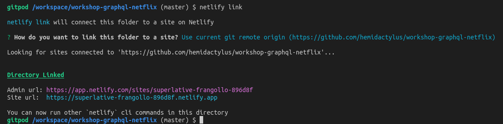

</details>

## 10. Deploy in production!

✅ **Step 10a:** Inject secrets to the Netlify site

```
netlify env:import .env
```

Now the (actually) serverless functions in Netlify have the connection
parameters they need.

<details><summary>Show me!</summary>

_Note: If you generated the `.env` with
`astra-cli`, the actual output is much more verbose._


</details>

✅ **Step 10b:** Build the app

Run
```
netlify build
```

<details><summary>Show me!</summary>

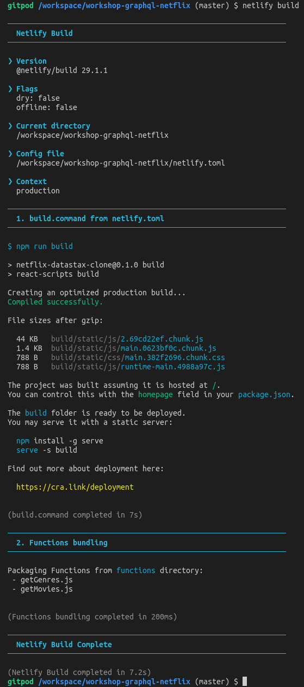

</details>

✅ **Step 10c:** Deploy!

```
netlify deploy --prod
```

✅ **Step 10d:** Visit your site.

```
netlify open:site
```

<details><summary>Show me!</summary>

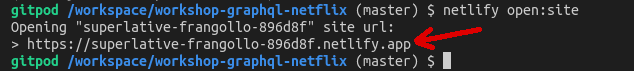

</details>

If needed, manually copy-paste your site URL in a new browser tab... and enjoy
your work!

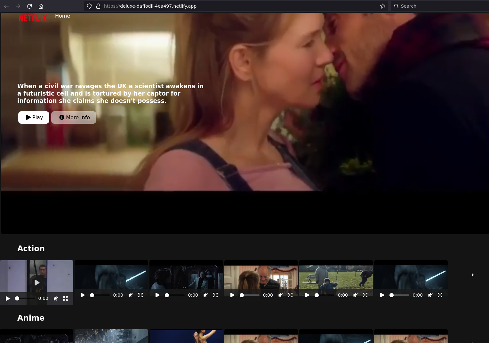

## The END

Congratulations, you made it!

Now don't forget to complete your assignment and [submit it](#homework)
to get your badge of completion!

```
       ██╗    ██╗███████╗██╗     ██╗          
       ██║    ██║██╔════╝██║     ██║          
       ██║ █╗ ██║█████╗  ██║     ██║          
       ██║███╗██║██╔══╝  ██║     ██║          
       ╚███╔███╔╝███████╗███████╗███████╗     
        ╚══╝╚══╝ ╚══════╝╚══════╝╚══════╝     
                                              
       ██████╗  ██████╗ ███╗   ██╗███████╗██╗ 
       ██╔══██╗██╔═══██╗████╗  ██║██╔════╝██║ 
       ██║  ██║██║   ██║██╔██╗ ██║█████╗  ██║ 
       ██║  ██║██║   ██║██║╚██╗██║██╔══╝  ╚═╝ 
       ██████╔╝╚██████╔╝██║ ╚████║███████╗██╗ 
       ╚═════╝  ╚═════╝ ╚═╝  ╚═══╝╚══════╝╚═╝ 
```

## Homework


Don't forget to complete your upgrade and get your verified skill badge! Finish and submit your homework!

1. Complete the practice steps from this repository as described below.
2. Insert a movie OR genre of your choice in the database (It's OK to re-use the trailer file URL from another movie! Just make the title recognizable as yours).
3. Take a screenshot of your Netflix clone running either from your Gitpod or (better) deployed to production in Netlify (in this case, you could also give us the Netlify URL).
4. The screenshot should clearly show the movie/genre you added (make sure you tell us its name in the submission comment field as well).
5. (Optional for extra wisdom) Watch the 2-hour video by Ania [HERE](#video-tutorial-with-ania-kubow), build the app yourself, and show us the running final result.
6. Submit your homework [here](https://dtsx.io/homework-graphql-netflix).

That's it, you are done! Expect an email next few week(s)!

# Extra resources

## Video tutorial with Ania Kubow
Thank you to our wonderful friend Ania Kubow for producing the Netflix clone. If you are not aware of Ania and love learning about coding you should absolutely check out her YouTube channel listed below.

While we focused on getting you up and running to production with Astra DB and Netlify, Ania's video will dig into more details on the app itself. Check it out to dig in more.

[Ania's Netflix Video](https://www.youtube.com/watch?v=g8COh40v2jU)
