<!--- STARTEXCLUDE --->
# 🎓 Netflix Clone using Astra DB and GraphQL

[](https://gitpod.io/from-referrer/)
[](http://www.apache.org/licenses/LICENSE-2.0)
[](https://discord.com/widget?id=685554030159593522&theme=dark)

*50 minutes, Intermediate, [Start Building](#1-login-or-register-to-astradb-and-create-database)*

A simple **ReactJS** Netflix homepage clone running on *Astra DB* that leverages the GraphQL API with *paging* and *infinite scrolling.*
This application is the result of the collaboration between [Ania Kubow](https://www.youtube.com/channel/UC5DNytAJ6_FISueUfzZCVsw) and the Datastax Developer Advocate team.

<!--- ENDEXCLUDE --->
See the [Video Walkthrough](https://imgur.com/3ns3UJB) of what you will build!

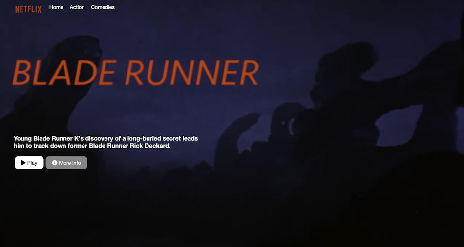

## 🎯 Objectives
* Build and run a Netflix clone.
* Learn **GraphQL API** and how to use it with a database to create the tables and navigate the data.
* Learn about **paging** and **infinite scrolling** in a Web UI.
* Leverage Netlify and DataStax Astra DB.
* Deploy the Netflix clone to production with Netlify.

## ℹ️ Frequently asked questions ℹ️

- *Can I run the workshop on my computer?*

> There is nothing preventing you from running the workshop on your own machine.
> If you do so, you will need
> * git installed on your local system
> * [node 15 and npm 7 or later](https://www.whitesourcesoftware.com/free-developer-tools/blog/update-node-js/)
>
> You will have to adapt commands and paths based on your environment and install the dependencies by yourself. **We won't provide support** to keep on track with schedule. However, we will do our best to give you the info you need to be successful.

- *What other prerequisites are there?*
> * You will need a github account
> * You will also need Netlify and Astra DB accounts, but we'll work through that in the exercises
> * Use **Chrome** or **Firefox** for the best experience. Other browsers are great, but don't work well with the GitPod integration we use a bit later.

- *Do I need to pay for anything for this workshop?*
> * **No.** All tools and services we provide here are FREE.

- *Will I get a certificate if I attend this workshop?*

> Attending the session is not enough. You need to complete the homeworks detailed below and you will get a nice badge.

## Materials for the Session

It doesn't matter if you join our workshop live or you prefer to do at your own pace, we have you covered. In this repository, you'll find everything you need for this workshop:

- [Slide deck](./slides/slides.pdf)
- [Workshop video](https://www.youtube.com/watch?v=y_jbhaiVCL0)
- [Discord chat](https://bit.ly/cassandra-workshop)
- [Questions and Answers](https://community.datastax.com/)

## Homework


Don't forget to complete your upgrade and get your verified skill badge! Finish and submit your homework!

1. Complete the practice steps from this repository as described below.
2. Insert a movie OR genre of your choice in the database (It's ok to copy an existing one, just change the name a bit so we can tell it is yours).
3. Take a screenshot of your Netflix clone running either from your Gitpod or (better) deployed to production in Netlify (in this case, you could also give us the Netlify URL).
4. The screenshot should clearly show the movie/genre you added (make sure you tell us its name in the submission comment field as well).
5. (Optional for extra wisdom) Watch the 2-hour video by Ania [HERE](#video-tutorial-with-ania-kubow), build the app yourself, and show us the running final result.
6. Submit your homework [here](https://dtsx.io/homework-graphql-netflix).

That's it, you are done! Expect an email next few week(s)!
  
# Let's start

## Table of contents

### Part I - DB Setup & Data Ingest
1. [Create Astra DB Instance](#1-login-or-register-to-astradb-and-create-database)
2. [Create a security token](#2-create-a-security-token)
3. [Create table **genre** with GraphQL](#3-create-table-genre-with-graphql)
4. [Insert data in **genre**  with GraphQL](#4-insert-data-in-the-table-with-graphql)
5. [Retrieve values of **genre** table](#5-retrieving-list-of-values)
6. [Create **movie** table](#6-creating-a-movies-table)
7. [Insert values in **movie** table](#7-insert-values-in-movie-table)
8. [Retrieve values from **movie** table](#8-retrieve-values-from-movie-tables)
9. [Load a CSV DataSet](#9-load-a-csv-dataset)

### Part II - Build Front-End
1. [Launch GitPod](#1-launch-gitpod-ide)
2. [Know your Gitpod](#2-know-your-gitpod)
3. [Serverless Functions](#3-serverless-functions)
4. [Fetching from the Front-End](#4-fetching-from-the-front-end)
5. [Install the Netlify CLI](#5-install-the-netlify-cli-command-line-interface)
6. [Retrieve connection parameters](#6-retrieve-connection-parameters)
7. [Configure Environment Variables and Install Dependencies](#7-configure-environment-variables-and-install-dependencies)
8. [Launch your app](#8-launch-your-app)

**Optional:** [deploy your site to Netlify](#want-to-deploy-the-netflix-clone-optional)

### Extra resources

- [Intro to GraphQL Workshop](https://github.com/datastaxdevs/workshop-intro-to-graphql)
- [React starter using NPX](https://github.com/datastaxdevs/react-basics)
- [React ToDo app](https://github.com/datastaxdevs/appdev-week1-todolist)
- [What is JamStack?](https://github.com/datastaxdevs/workshop-battlestax/blob/master/README_JAM.md)
- [Video tutorial with Ania Kubow](#video-tutorial-with-ania-kubow)

# Part 1 - DB Setup & Data Ingest

## 1. Login or Register to AstraDB and create database

> 🎁 *When creating your instance, use the promotion code **ANIA200** to get 200$ of additional free credit!*

**`ASTRADB`** is the simplest way to use Cassandra in an application with almost zero operations  - just push the button and get your cluster. No credit card required, $25.00 USD credit every month, roughly 20M reads/writes, 80GB storage monthly - sufficient to run small production workloads. Click here to start:

<a href="https://astra.dev/6-15"></a>

Follow the instructions on [creating an Astra DB instance](https://awesome-astra.github.io/docs/pages/astra/create-instance/#c-procedure) and use the following values:

|Field| Value|
|---|---|
|**database name**| `workshops` |
|**keyspace**| `netflix` |

_Note: If you already have a database named `workshops` you can just add the keyspace name `netflix` to it. You may need to "Resume" the database first._

The status will change from `Pending` to `Active` when the database is ready, this will only take 2-3 minutes. You will also receive an email when it is ready.

[🏠 Back to Table of Contents](#table-of-contents)


## 2. Create a security token

[Create a token for your app](https://awesome-astra.github.io/docs/pages/astra/create-token/#c-procedure), _using the "Database Administrator" role_. Keep it handy for later use (best to download the CSV token, as the values
will not be visible afterward). The token you'll need looks like `AstraCS:KDfdKeNREyWQvDpDrBqwBsUB:ec80667c....`

[🏠 Back to Table of Contents](#table-of-contents)


## 3. Create table **genre** with GraphQL

✅  **Step 3a:** Open **GraphQL Playground** by 
1. Click on your active database
2. Click `Connect` TAB
3. Click `GRAPHQL API`
4. Click link to your playground.

*As show on the picture below.*


> *Note that values in the picture do no reflect the database name `workshops`, reason is we do not reproduce every picture each time*

✅  **Step 3b:** In GraphQL Playground ("graphql-schema" tab), **Populate HTTP HEADER** variable `x-cassandra-token` on the bottom of the page with your token as shown below


✅  **Step 3c:** In GraphQL Playground, create a table with the following mutation, (making sure to replace `netflix` if you used a different keyspace name):

- Copy the following mutation on the left panel
```yaml
mutation {
  reference_list: createTable(
    keyspaceName:"netflix",
    tableName:"reference_list",
    ifNotExists:true
    partitionKeys: [ 
      { name: "label", type: {basic: TEXT} }
    ]
    clusteringKeys: [
      { name: "value", type: {basic: TEXT}, order: "ASC" }
    ]
  )
}
```
* Use the big "play-button" arrow in the middle of the screen to execute the query


**GraphQL Playground troubleshooting** (covers this whole section)

|Trouble| Shooting|
|---|---|
|Server cannot be reached | Add Astra token to headers (including `AstraCS:...`; check quotes) |
|Server cannot be reached (second tab) | Check playground target URL ends with `netflix` |
Response not successful: Received status code 401 | Same as "server cannot be reached" |
| Response not successful: Received status code 404 | Check spelling of keyspace in target URL |
|"Play" button does nothing| Ensure query is syntactically correct |
"Validation error of type FieldUndefined" | Most likely query in the wrong tab |

[🏠 Back to Table of Contents](#table-of-contents)

## 4. Insert data in the Table with GraphQL

✅  **Step 4a:** In graphQL playground, change tab to now use `graphql`. Edit the end of the URl to change from `system` to the name of your keyspace: `netflix`

✅  **Step 4b:** Populate **HTTP HEADER** variable `x-cassandra-token` on the bottom of the page with your token as shown below (again !! yes this is not the same tab)


✅  **Step 4c:** In GraphQL Playground,populate the `reference_list` table with the following values

- Copy the following mutation on the left panel

```yaml
mutation insertGenres {
  action: insertreference_list(value: {label:"genre", value:"Action"}) {
    value{value}
  }
  anime: insertreference_list(value: {label:"genre", value:"Anime"}) {
     value{value}
  }
  award: insertreference_list(value: {label:"genre", value:"Award-Winning"}) {
     value{value}
  }
  children: insertreference_list(value: {label:"genre", value:"Children & Family"}) {
     value{value}
  }
  classic: insertreference_list(value: {label:"genre", value:"Classic"}) {
     value{value}
  } 
  comedies: insertreference_list(value: {label:"genre", value:"Comedies"}) {
     value{value}
  }
  crime: insertreference_list(value: {label:"genre", value:"Crime"}) {
     value{value}
  } 
  cult: insertreference_list(value: {label:"genre", value:"Cult"}) {
     value{value}
  }  
  documentaries: insertreference_list(value: {label:"genre", value:"Documentaries"}) {
     value{value}
  }
  drama: insertreference_list(value: {label:"genre", value:"Dramas"}) {
     value{value}
  }
  fantasy: insertreference_list(value: {label:"genre", value:"Fantasy"}) {
     value{value}
  }
  french: insertreference_list(value: {label:"genre", value:"French"}) {
     value{value}
  }
  horror: insertreference_list(value: {label:"genre", value:"Horror"}) {
     value{value}
  }
  independent: insertreference_list(value: {label:"genre", value:"Independent"}) {
     value{value}
  }
  international: insertreference_list(value: {label:"genre", value:"International"}) {
     value{value}
  } 
  musicmusicals: insertreference_list(value: {label:"genre", value:"Music & Musicals"}) {
     value{value}
  } 
  realitytv: insertreference_list(value: {label:"genre", value:"Reality TV"}) {
     value{value}
  } 
  romance: insertreference_list(value: {label:"genre", value:"Romance"}) {
     value{value}
  }
  scifi: insertreference_list(value: {label:"genre", value:"Sci-Fi"}) {
     value{value}
  }
  thriller: insertreference_list(value: {label:"genre", value:"Thriller"}) {
     value{value}
  } 
  tvshow: insertreference_list(value: {label:"genre", value:"TV Show"}) {
     value{value}
  } 
}
```

* Use the big "play-button" arrow in the middle of the screen to execute the query

[🏠 Back to Table of Contents](#table-of-contents)

## 5. Retrieving list of values

✅  **Step 5a:** In GraphQL Playground, not changing tab (second tab: "graphql", yeah) list values from the table with the following query.

```yaml
query getAllGenre {
    reference_list (value: {label:"genre"}) {
      values {
      	value
      }
    }
}
```

*👁️ Expected output*


[🏠 Back to Table of Contents](#table-of-contents)

## 6. Creating a Movies Table

✅  **Step 6a:** Switch back to first tab ("graphql-schema"). The token header should be already set, use the following mutation to create a new table:
_Remember to change the keyspaceName if you used something different_.

```yaml
mutation {
  movies_by_genre: createTable(
    keyspaceName:"netflix",
    tableName:"movies_by_genre",
    ifNotExists: true,
    partitionKeys: [
      { name: "genre", type: {basic: TEXT} }
    ]
    clusteringKeys: [ 
      { name: "year", type: {basic: INT}, order: "DESC" },
      { name: "title", type: {basic: TEXT}, order: "ASC" }
    ]
    values: [
      { name: "synopsis", type: {basic: TEXT} },
      { name: "duration", type: {basic: INT} },
      { name: "thumbnail", type: {basic: TEXT} }
    ]
  )
}
```

*👁️ Expected output*


[🏠 Back to Table of Contents](#table-of-contents)

## 7. Insert Values in Movie table

✅  **Step 7a:** Now go to tab "graphql" again. Everything should be set: use the following mutation to populate the `movies_by_genre` table: 

```yaml
mutation insertMovies {
  inception: insertmovies_by_genre(
    value: { 
      genre:"Sci-Fi", 
      year:2010,
      title:"Inception",
      synopsis:"Cobb steals information from his targets by entering their dreams.",
      duration:121,
      thumbnail:"https://i.imgur.com/RPa4UdO.mp4"}) {
        value{title}
    }
  
  prometheus: insertmovies_by_genre(value: { 
      genre:"Sci-Fi", 
      year:2012,
      title:"Prometheus",
      synopsis:"After a clue to mankind's origins is discovered, explorers are sent to the darkest corner of the universe.",
      duration:134,
      thumbnail:"https://i.imgur.com/L8k6Bau.mp4"}) {
        value{title}
    }
  
  	aliens: insertmovies_by_genre(value: { 
      genre:"Sci-Fi", 
      year:1986,
      title:"Aliens",
      synopsis:"Ellen Ripley is sent back to the planet LV-426 to establish contact with a terraforming colony.",
      duration:134,
      thumbnail:"https://i.imgur.com/QvkrnyZ.mp4"}) {
        value{title}
    }
  
    bladeRunner: insertmovies_by_genre(value: { 
      genre:"Sci-Fi", 
      year:1982,
      title:"Blade Runner",
      synopsis:"Young Blade Runner K's discovery of a long-buried secret leads him to track down former Blade Runner Rick Deckard.",
      duration:145,
      thumbnail:"https://i.imgur.com/xhhvmj1.mp4"}) {
        value{title}
    }
  }
```

*👁️ Expected output*


> ℹ️ You can find more movie data in the `data` folder, however, we will be doing a bulk import of all this data shortly.

[🏠 Back to Table of Contents](#table-of-contents)

## 8. Retrieve values from Movie tables

✅  **Step 8a:** In GraphQL Playground, not changing tab (still second tab, "graphql", yeah) list values from the table with the following command:

```yaml
query getMovieAction {
    movies_by_genre (
      value: {genre:"Sci-Fi"},
       orderBy: [year_DESC]) {
      values {
        year,
        title,
        duration,
        synopsis,
        thumbnail
      }
    }
}
```

*👁️ Expected output*


✅ **Step 8b Enable paging:** For small datasets you can retrieve all values in the table but for performance or network reasons you need to perform paging. Let's do same query as before now asking for a `page size to 2`

```yaml
query getMovieAction {
    movies_by_genre (
      value: {genre:"Sci-Fi"},
       options: {pageSize: 2},
       orderBy: [year_DESC]) {
      values {
        year,
        title,
        duration,
        synopsis,
        thumbnail
      }
    pageState
    }
}
```

*👁️ Expected output*


✅ **Step 8c: Fetch next page paging:**  Notice that `pageState` is also now returned. Let's use it to fetch the next 2 items (next page). Edit the next query to replace your own pageState `YOUR_PAGE_STATE`

```yaml
query getMovieAction {
    movies_by_genre (
      value: {genre:"Sci-Fi"},
       options: {pageSize: 2, pageState: "<YOUR_PAGE_STATE>"},
       orderBy: [year_DESC]) {
      values {
        year,
        title,
        duration,
        synopsis,
        thumbnail
      }
    pageState
    }
}
```
 
*👁️ Expected output*


[🏠 Back to Table of Contents](#table-of-contents)

## 9. Load a CSV DataSet

✅ **Step 9a: Download the dataset**

To download the DATASET, right-click (or CTRL + Click to open in new tab) the button below and download the target file on your machine.

> *If the file opens in the browser save it with the name `movies_by_genre.csv`. This is important as the filename will be the table name.*

<p align="left">
<a href="https://raw.githubusercontent.com/datastaxdevs/appdev-week3-graphql/main/data/movies_by_genre.csv">
 
</a>
</p>

✅ **Step 9b: Open Astra Data Loader Importer**

- Locate the `Load Data` button to open the Data Loader.


✅ **Step 9c: Upload the dataset**

Click on the area Drag n drop a single file and look for the file `movies_by_genre.csv` on your machine, this file has been downloaded in step 9b.


Once the file has been upload notice the `Upload Successful` message in green. You can now click `NEXT`

✅ **Step 9d: Define target table**

- Locate the field Table Name and make sure it is set to `movies_by_genre`


- In `Keys and Clustering` section enter `genre` as the partition key.


You can now click on `NEXT` to move forward.

✅ **Step 9e: Define target database**


Select the database we are currently using:

| Field | Value |
| --- | --- |
| **Target Database** | `workshops` |
| **Target Keyspace** | `netflix` |

and click next to start the process asynchronously.

✅ **Step 9f: Wait for the batch to import your data**

After a few seconds (about 30s) ,you will get an email informing you that the batch has been scheduled.


As you can see the operation here is asynchronous. About a minute later your will get another email to tell you the data has been inserted.


**Congratulations the Database is SET !!!**

[🏠 Back to Table of Contents](#table-of-contents)

# Part 2 - Build Front-End

## 1. Launch GitPod IDE
- Click the button to launch the GitPod IDE.

* _Supported by  Chrome and  Firefox_

[](https://gitpod.io/#https://github.com/datastaxdevs/workshop-graphql-netflix)

   
ℹ️ _It may take minutes (approx. 3-5) for GitPod to fully initialize._

## 2. Know your gitpod

Take a moment to read this entire section since it'll help you with the rest of the workshop as you'll be spending lot of your time in Gitpod. If you're familiar with Gitpod, you can easily skip this entire section.

The extreme left side has the explorer view(1). The top left, middle to right is where you'll be editing files(2), etc. and the bottom left, middle to right is what we will refer to as the Gitpod terminal window(3) as shown below.

**👁️ Expected output**


You can always get back to the file explorer view whenever by clicking on the hamburger menu on the top left followed by `View` and `Explorer` as shown below.


✅ **Step 2a: Know your public URL**

The workshop application has opened with an ephemeral URL. To know the URL where your application endpoint will be exposed you can run the following command in the terminal after the build has completed. **Please note this URL and open this up in a new browser window as shown below**.

```bash
gp url 8888
```

**👁️ Expected output**


Although the application is not running yet, 
launch a new browser window (**don't close it for the rest of the workshop since you'll continually keep using this**. If you accidentally close it, just come back to this step. The browser will generate an error (due to application not running yet) which is fine for now as shown below.

**👁️ Expected output**


You may encounter the following at different steps and although this may not be applicable right away, the steps are included **in advance** and summarized here so that you can keep an eye out for it. Different paths and different environments might be slightly different although Gipod levels the playing field a bit.

You can allow cutting and pasting into the window by clicking on `Allow` as shown below.


Or allow ports to be opened by just exiting windows that are informational messages about ports like below.


## 3. Serverless Functions

Take a look at `functions/getGenres.js`

``` javascript
const fetch = require('node-fetch')

exports.handler = async function (event) {

  const body = JSON.parse(event.body)
  const url = process.env.ASTRA_GRAPHQL_ENDPOINT
  const query = `
    query getAllGenres {
      reference_list (
        value: { label: "genre"},
        options: {
          pageSize: ${JSON.stringify(body.pageSize)},
          pageState: ${JSON.stringify(body.pageState)}
        }
      ) {
        values {
          value
        }
        pageState
      }
    }
  `

  const response = await fetch(url, {
    method: 'POST',
    headers: {
      "Content-Type": "application/json",
      "x-cassandra-token": process.env.ASTRA_DB_APPLICATION_TOKEN
    },
    body: JSON.stringify({ query })
  })

  try {
    const responseBody = await response.json()
    return {
      statusCode: 200,
      body: JSON.stringify(responseBody)
    }
  } catch (e) {
    console.log(e)
    return {
      statusCode: 500,
      body: JSON.stringify(e)
    }
  }
}
```

You'll notice the familiar GraphQL query "getAllGenres" we used previously in the playground. It's been modified a bit to utilize paging.

``` javascript
options: {
  pageSize: ${JSON.stringify(body.pageSize)},
  pageState: ${JSON.stringify(body.pageState)}
}
```

This section allows us to pass in the desired page size and current page state from the front-end.

``` javascript
{
  values {
    value
  }
  pageState
}
```

And, in addition to the values of the query, we are also returning the page state from the query.

The serverless function `functions/getMovies.js` works in much the same way, though we pass in the specific genre we want, and are hardcoding the page size to 6.

``` javascript
query {
  movies_by_genre (
    value: { genre: ${JSON.stringify(genre)}},
    orderBy: [year_DESC],
    options: { pageSize: 6, pageState: ${JSON.stringify(pageState)} }
  ) {
    values {
      year,
      title,
      duration,
      synopsis,
      thumbnail
    }
    pageState
  }
}
```

## 4. Fetching from the Front-End

Let's take a look at how we fetch from these serverless functions from the front-end. Start in `src/App.js`

We have a fetch method defined that will retrieve a page of genres by calling the `getGenres` serverless function.

``` javascript
const fetchData = async () => {
  if (! isFetching)  {
    setIsFetching(true)
    const response = await fetch("/.netlify/functions/getGenres", {
      method: "POST",
      body: JSON.stringify({pageState, pageSize}),
    })
    const responseBody = await response.json()
    setPageState(responseBody.data.reference_list.pageState)
    setGenres(gs => (gs || []).concat(responseBody.data.reference_list.values))
    setIsFetching(false)
  }
}
```

We pass in the current `pageState` and `pageSize` state variables and receive a response from the serverless function. We then set the `pageState` var to the new pagestate, and set the `genres` state variable to the received data. (Note that we are concatenating the new data to the var, since we want to keep all previously fetched data, not replace).

When we render the page, generate a `<Section>` component for each genre, and set a `<div>` to detect a mouseEnter to load the next page of genres.

``` javascript
<>
  <NavBar />
  <HeroSection />
  {genres && (
    <div className="container">
      {Object.values(genres).map((genre) => (
        <Section key={genre.value} genre={genre.value} />
      ))}
    </div>
  )}
  <div
    className="page-end"
    onMouseEnter={() => {
      setRequestedPage( np => np + 1 )
    }}
  />
</>
```

The `<Section>` component works in the same way, though we will fully replace the data in the `movies` variable.

``` javascript
const fetchData = async () => {
  const response = await fetch("/.netlify/functions/getMovies", {
    method: "POST",
    body: JSON.stringify({ genre: genre, pageState: pageState }),
  })
  const responseBody = await response.json()
  setMovies(responseBody.data.movies_by_genre.values)
  setPageState(responseBody.data.movies_by_genre.pageState)
}
```

Now that we know how the front-end works, let's launch our app!

## 5. Install the Netlify CLI (Command Line Interface)
 * In the `workshop-graphql-netflix` directory run the following command to install the netlify-cli
 ```
 npm install -g netlify-cli
```

<details><summary>Show me!</summary>

</details>

## 6. Retrieve connection parameters

You need two important parameters to enable the serverless functions
to authenticate and access your database: the DB token and the GraphQL endpoint URL.

The **token** is the one you generated [earlier](#2-create-a-security-token) (the one looking something like
`AstraCS:KDfdKeNREyWQvDpDrBqwBsUB:ec80667c....`).

The **GraphQL endpoint** is the URL for the "graphql" part of the GraphQL Playground
you used [earlier](#4-insert-data-in-the-table-with-graphql). It looks like `https://b2f[...]-us-east1.apps.astra.datastax.com/api/graphql/netflix`.

> Tip: you can always [generate a new "DB Administrator" token](https://awesome-astra.github.io/docs/pages/astra/create-token/#c-procedure) if needed;
> likewise, you can retrieve the GraphQL endpoint by heading to the Astra DB "connect"
> page for your database, select "GraphQL API" and scroll down the page
> until you see a "Write Data" section. You may need to change the ending of the
> URL given there to reflect the correct keyspace name, see the next images for
> a visual guide.

<details><summary>Show me how to find my GraphQL endpoint</summary>

First, go to the Astra DB connect page for your database.
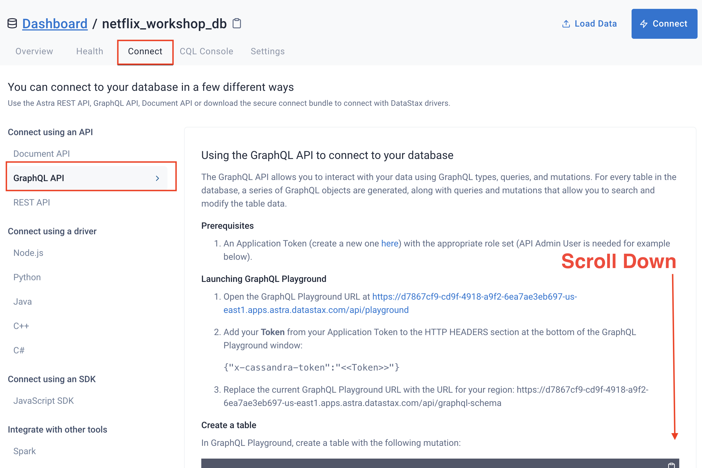
Then scroll down to find the endpoint for your keyspace.
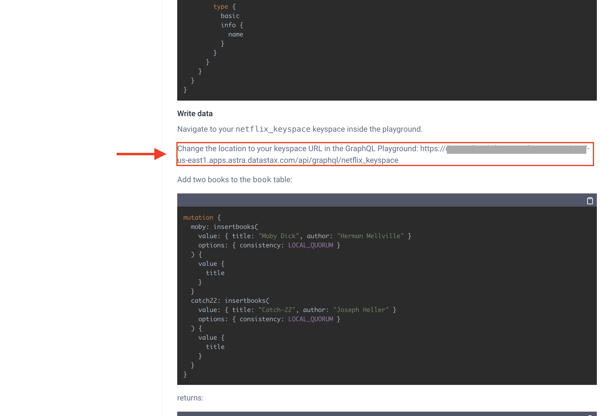

</details>

## 7. Configure Environment Variables and Install Dependencies

✅ Create `.env` file (e.g. with `touch .env; gp open .env`), containing the two
strings you just collected:

```ini
ASTRA_DB_APPLICATION_TOKEN=REPLACE_ME
ASTRA_GRAPHQL_ENDPOINT=REPLACE_ME
```

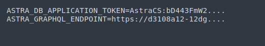


👩‍💻  Install all the packages

```bash
npm install
```

## 8. Launch your app
  * Run the application 
  ```
  netlify dev
  ```
  * The application should automatically launch in the GitPod preview pane


# Extra resources

## Video tutorial with Ania Kubow
Thank you to our wonderful friend Ania Kubow for producing the Netflix clone. If you are not aware of Ania and love learning about coding you should absolutely check out her YouTube channel listed below.

While we focused on getting you up and running to production with Astra DB and Netlify, Ania's video will dig into more details on the app itself. Check it out to dig in more.

[Ania's Netflix Video](https://www.youtube.com/watch?v=g8COh40v2jU)

# Want to Deploy the Netflix Clone [Optional]?

Follow these steps to Deploy the Netflix clone to your own Netlify site!


## 1. Deploy to Netlify

- <details><summary> What does the netlify deploy button do?</summary>The Netlify deploy button will:<ul>
    <li>Create a new repository for you on Github</li>
    <li>Create a site on Netlify</li>
    <li>Link the two together.</li></ul>
</details>

- Click the button to deploy

  [](https://app.netlify.com/start/deploy?repository=https://github.com/datastaxdevs/workshop-graphql-netflix)
 * <details><summary>Show me!</summary>
    
    </details>

This will take a few minutes.

  * If there is an existing account in Netlify, make sure the Netlify account settings show that it's connected to the appropriate git repository,
    <details>
    <summary>Show me! </summary>
    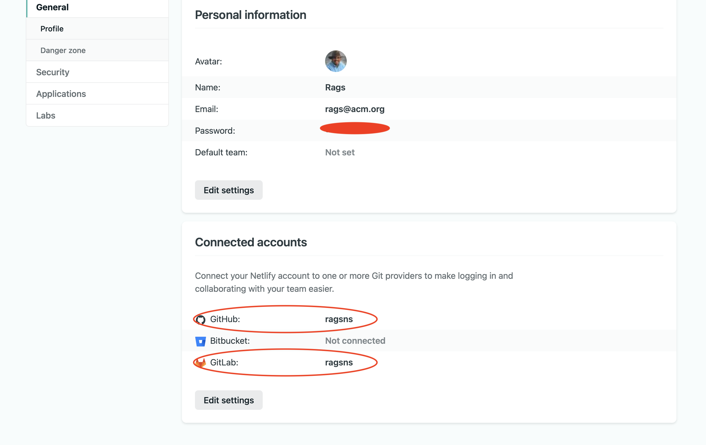
    </details>

  * Click on `Site deploy in progress` within the Netlify UI, 
    <details>
    <summary>Show me! </summary>
    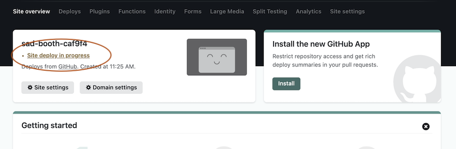
    </details>

  * Click the top deploy link to see the build process.
    <details>
    <summary>Show me! </summary>
    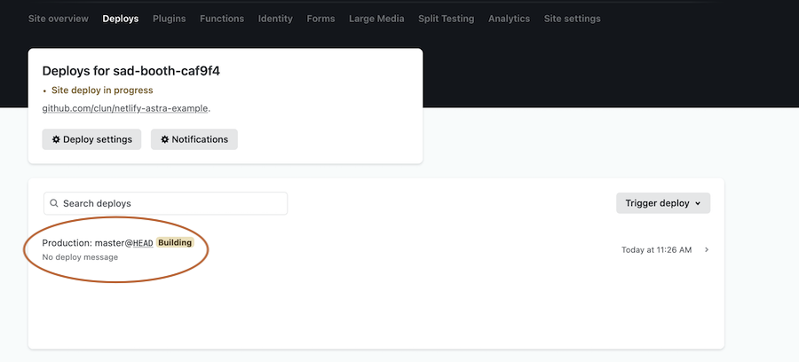
    </details>

  * Wait until the build complete `Netlify Build Complete`,  **When you see Pushing to repository** you're ready to move on.
    <details>
    <summary>Show me! </summary>
    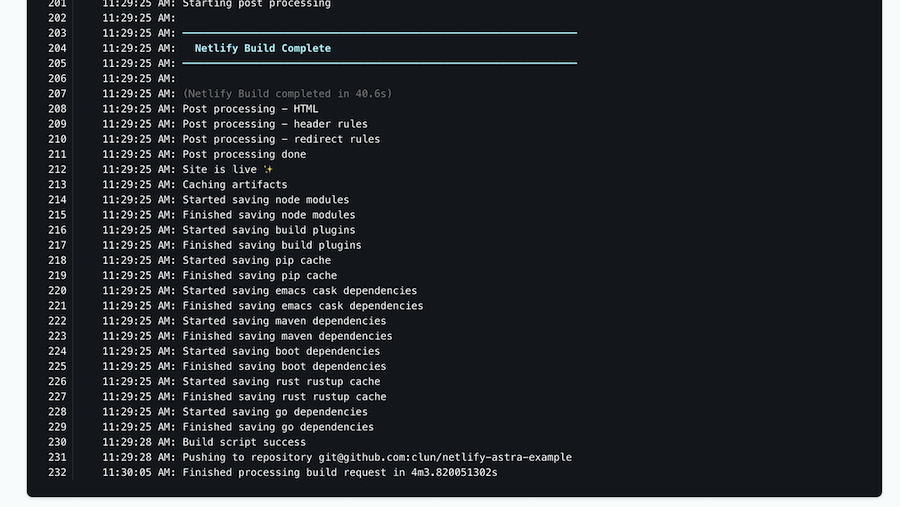
    </details>

  * Scroll up to the top and click on the site name (it'll be after {yourlogin}'s Team next to the Netlify button).
    <details>
    <summary>Show me! </summary>
    
    </details>

## 2. Access your GitHub repository

  * Click on the `GitHub` in `Deploys from GitHub` to get back to your new repository.  Scroll to where you were in the README.
    <details>
    <summary>Show me! </summary>
    
    </details>

## 3. Follow Part 2 in **YOUR** Repository

**Note** At this point, you MUST be reading this README from **YOUR** Github repository.
That is, if the address bar still says `https://github.com/datastaxdevs/...` please
head over to YOUR copy of the repo before going the Gitpod route!

Use this link to open Gitpod from **YOUR** repository! (_Tip: Ctrl-click on the button_)

[](https://gitpod.io/from-referrer/)

<details>
<summary>(Psst, ... show me a workaround)</summary>

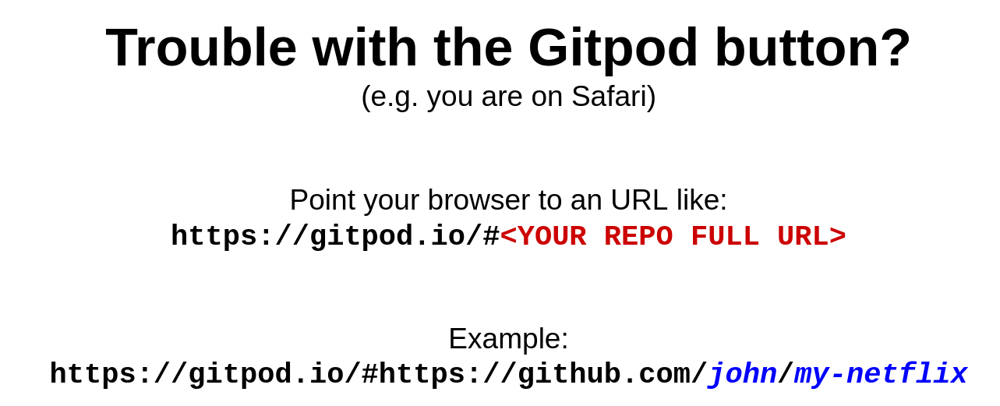

</details>

Once you are up and running in Gitpod, follow all steps in Part 2, summarized here for convenience:

- (wait 2-3 minutes, until the console prints _"workshop-astra-NETFLIX gitpod ready - LET'S DO THIS!"_);
- `npm install -g netlify-cli` ;
- collect [token and GraphQL endpoint URL](#6-retrieve-application-token-to-securely-connect-to-the-database);
- create and fill `.env` file with the connection params;
- `npm install` ;
- `netlify dev` as sanity check (will open the same URL you'd get from `gp url 8888`, you should see the app running all right).

## 4. Connect Netlify to your site

Execute each of the commands below to link your code to your Netlify deployment.

✅ **Step 4a:**  we'll need to **STOP** the `netlify dev` command if you still have it running. In the terminal where you executed the netlify command issue a `CTRL+C` (control key + the C key) in order to stop the process.

✅ **Step 4b:** Enter the following command to pop up a browser to authenticate with netlify

  ```
  netlify login
  ```

*👁️ Expected output*
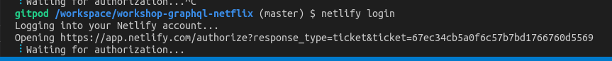

✅ **Step 4c:** Open the link your see above (`https://app.netlify.com/authorize?response[...]`)
in a new WINDOW for the link to work, and authorize Netlify CLi to access Netlify on your behalf.

> When using GitPod the preview pane **will not display this properly.** You must click the "open in a new window" button in the very top right of the preview pane._

*👁️ Expected output after authorizing Netlify*

```
You are now logged into your Netlify account!

Run netlify status for account details

To see all available commands run: netlify help

gitpod /workspace/workshop-graphql-netflix (master) $
```

✅ **Step 4d:** link your workspace to the associated site with the following command

```
netlify link
```

*👁️ Expected output (after accepting the default link target)*


✅ **Step 4e:** inject the secrets contained in the `.env` to Netlify:
  
```
netlify env:import .env
```

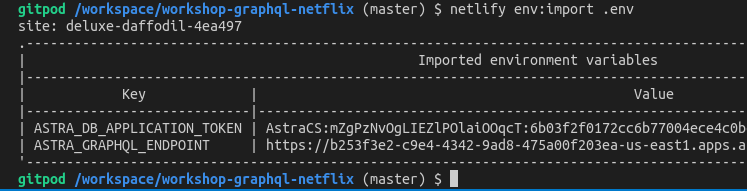

<!--
  * Will be used to allow you to execute `netlify open`
  ```
  netlify sites:list
  ```
-->

## 5. Deploy to production
Now that you've hooked everything up, time to deploy to production.

Run
```
netlify build
```

Then run
```
netlify deploy --prod
```

Then finally run
```
netlify open:site
```
(you may need to manually pick the URL of the deployed application and open it in a new browser tab).
  
You've deployed your app to Netlify!


## The END

Congratulations, you made it to the END of the show.


**🧑🏻‍🤝‍🧑🏽 Let's get in touch**

|                            |
| ---------------------------------------------------------- |
| Rags Srinivas <br>[@ragsns](https://github.com/ragsns) |

[🏠 Back to Table of Contents](#0-table-of-contents)
---

[]()